# chart-race-react

> 📊 Seamless & fully customizable bar chart race component for React.

> https://www.npmjs.com/package/chart-race-react .

<p align=center>
    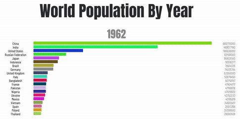
</p>

## Quick Start
```
npm install --save chart-race-react
```
```javascript
import BarChart from 'chart-race-react';
```
You should wrap `BarChart` inside a container `div` that acts as a sandbox. The width of the `BarChart` fits the container width.
```jsx
<div style={{width: "500px"}}>
    <BarChart />
</div>
```
## Demo

|||||
|---|---|---|---|
|Colors|<p align=center>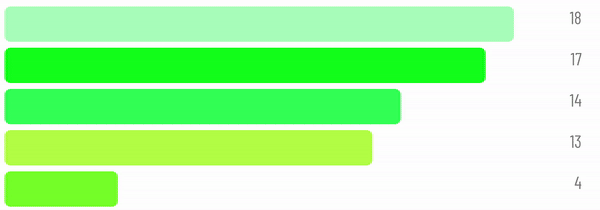</p>|<p align=center>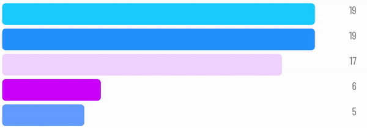</p>|<p align=center>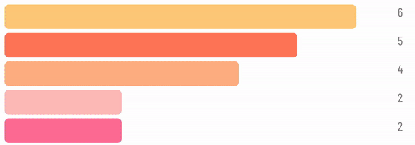</p>|
|Style|<p align=center>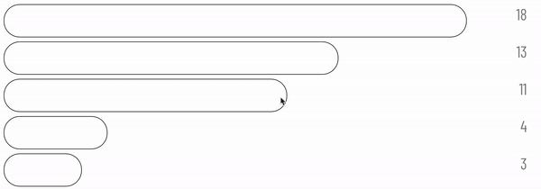</p>|<p align=center>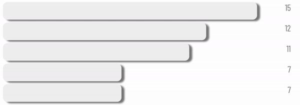</p>|<p align=center>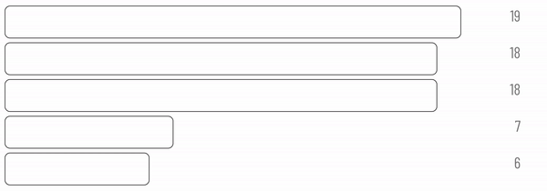</p>|
|Speed|<p align=center>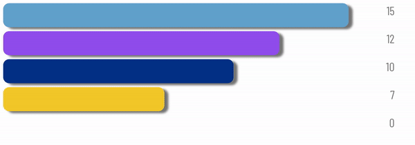</p>|<p align=center>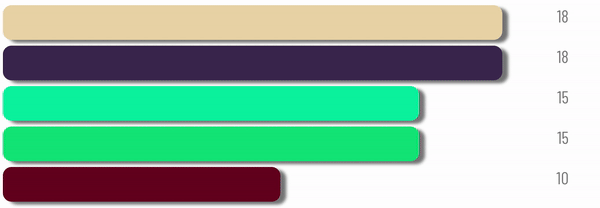</p>|<p align=center>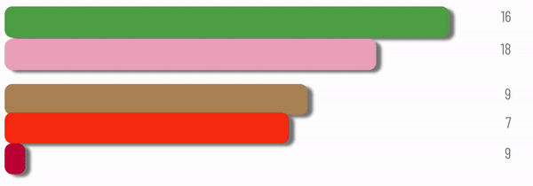</p>|
|||||

## Usage 
> Passing props.

You will need to pass your own props to the `BarChart` component. Refer to `examples` for more information.

|Prop|Type|Explanation|
|---|---|---|
|**start**|Boolean|Defines whether the bar chart race has started. Default is `true` and the chart race will start as the component mounts.|
|**data**|Object|An object with keys being the data field name and value being Array data. `data[key].length` should be equal to **len**.|
|**timeline**|Array|An array defining the time indices. Length should be equal to **len**.|
|**labels**|Object|An object with keys being the data field name and value being a HTML element that acts as the data field's label.|
|**colors**|Object|An object with keys being the data field name and value being the color the data bar.|
|**timeout**|Integer|Transition time between adjacent time indices (in ms).|
|**delay**|Integer|Waiting time between adjacent time indices (in ms).|
|**timelineStyle**|Object|CSS style objects for time indices.|
|**textBoxStyle**|Object|CSS style objects for data text.|
|**barStyle**|Object|CSS style object defining the style of all the bars. It is advised to use `height` to define the thickness and `marginTop` to define the distance between adjacent bars.|
|**width**|Array|Defines the width allocation for label, bar, and text box. Values in **width** should add up to 100.|
|**maxItems**|Integer|Defines the maximum number of items to show in the chart. Should be less or equal to `Object.keys(data).length`.|

## More Demo 
Easibly define custom data, text styles, colors, duration, and layout.

<p align=center>
    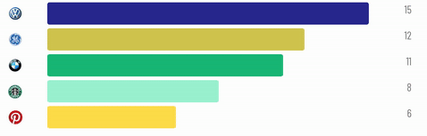
</p>